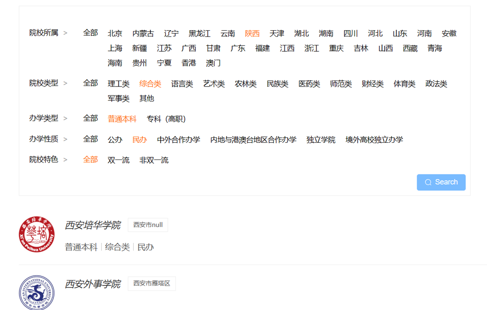
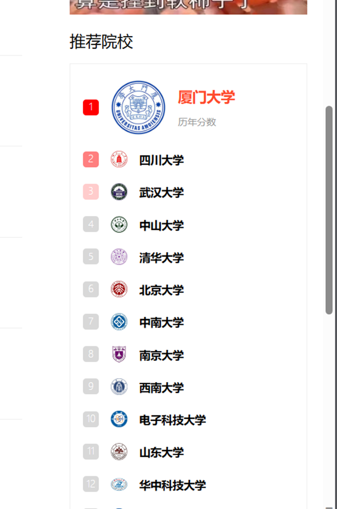
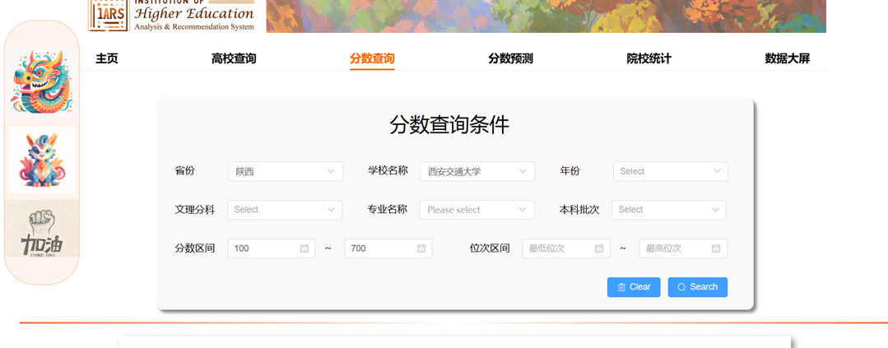
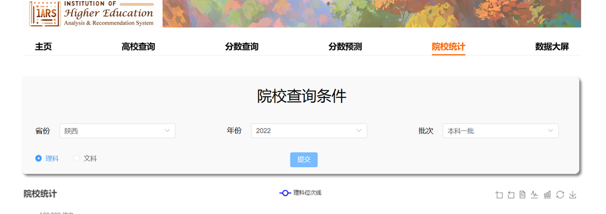
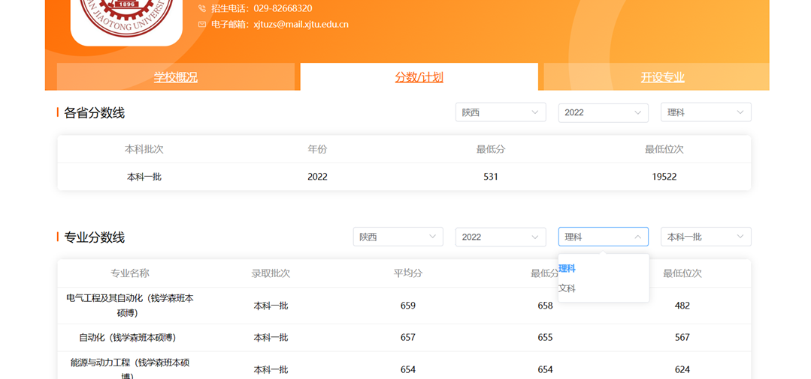

# 项目背景
高考分数查询分析与预测大数据平台前台页面部分，部分页面为学习和模仿掌上高考。主要涵盖信息展示、分数学校查询、数据大屏相关功能
# 技术栈
vue3（响应式）、element plus组件库、vuex数据管理、vue router路由控制、mockjs模拟接口、echarts可视化

# 补充说明
这是一个开发时间为两个星期前端零基础小白的学习作品，自娱自乐之余，希望通过开源给广大求学者一些经验和借鉴，由于本人也是学生，在技术道路上也是摸爬滚打的阶段，因此代码规范程度不佳还请谅解。

# 项目运行方法
`git clone`拉取仓库 

将文件夹`gaokao`以项目打开(`cd /gaokao`)

命令行运行`npm install`

命令行运行`npm run serve`

# 项目介绍与演示

## 1.	门户网站首页
访问系统网址会默认进入主页，主页是对功能的汇总以及信息的集合。其用意为向用户展示最新、实用信息，方便用户扩展视野。 设计方面，首页会展示若干学校校园分光，并根据后端内容向用户推荐热门院校与专业，以便使用者与最新信息接轨，提升用户满意度。 功能方面，用户可以在主页分数查询模块输入自身信息，并携参跳转至分数查询界面。此外，若用户对推荐内容感兴趣，可以自行点击前往对应学校主页。

## 2.	高校查询 

高校查询部分，用户具有一定的选择权力。用户可以根据自身情况以及对高校的兴趣，自主选择学校标签进行筛选。系统会根据数据库内容返回符合要求的列表，以供用户选择、浏览。

此外，在该部分还会向用户以纵向列表的形式推荐若干热门院校。此内容不取决于用户选择

## 3.分数查询
在该部分，用户可以根据自身情况填写、选择表单内容（若不填则默认为全选），查询自身可能符合的学校、专业。该页面旨在为已有预估成绩的学生提供全面、可行的选择，方便用户快速检索、筛选数据。

## 4.分数预测

该页面功能为预估学校的投档线与位次。我们采用最小二乘的拟合方法，根据以往3年的录取数据，预测2024年高校投档线。用户可以在页眉处的表单选择学校与文理科目并进行预测。

## 5.院校查询

该界面为用户提供院校的统计信息。用户首先在表单处选择省份、年份、批次与文理科目，提交申请后，页面会将该省份复合要求的统计信息展示在曲线图中，展示不同最低位次可以填报的学校。

## 6.数据大屏

该部分向用户展示了高校的大数据统计信息，具体统计了：热搜专业、不同办学性质高校数、各省份高校数、热搜高校排名、不同办学类型高校数。这部分表格均使用Echarts表格，用户可以与表格交互。

## 7.高校详细信息
这部分页面并不提供直接、显式的入口，用户需要在上述页面中点击高校图标或名称跳转至对应校园页面。高校信息分为三部分：学校概况：展示学校基本信息

分数/计划：用户可以根据不同隐藏菜单筛选该校在不同领域的录取分数线
